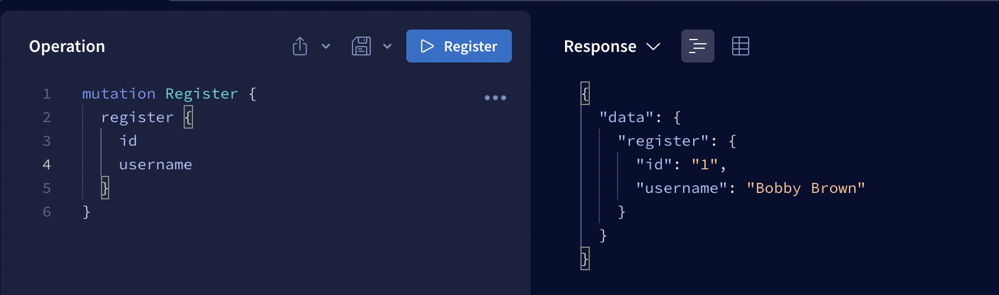

# GraphQL Overview

## Why we used apollo server? // What GraphQL server should I use?

- multiple different options

1. Apollo Server 2.0\* - Most popular and has the most features. But has the largest bundle size (528 kb)
2. Express graph GraphQL - 180 kb bundle size
3. Graph QL yoga - 530 kb.

### reccomended packages

To install dev depedencies, use the following command

```
npm install -D nodemon
```

- add "GraphQL for VSCode" in VS studio to help with coding


# to run the code

- run npm install
- go to the root of the folder and type

```
node index.js
```

## Basic Types

- The values in the function will be cast to the defined type if possible. E.g. 7 here gets cast to a string.

[](/7.png)

- However the reverse won't happen, we couldn't cast a string to an integer.
- We will get exactly what we expect to get back from the server. Otherwise we will get an error in response.
- We can put a "!" on the return type. This will either allow us or prevent us from returning a null value.

[](./NULL.png)

- Query is for getting values. Read operations in CRUD
- Mutation is for changing, updateing or deleting values in CRUD.
- We have standard types, Integers, Booleans, Strings, IDs e.t.c but we can also create custom types for what we want the server to respond with.

- We can then request what we want from the server!


