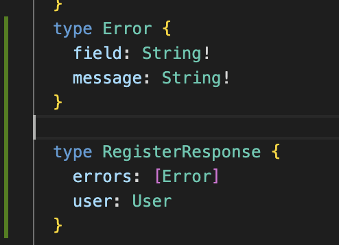
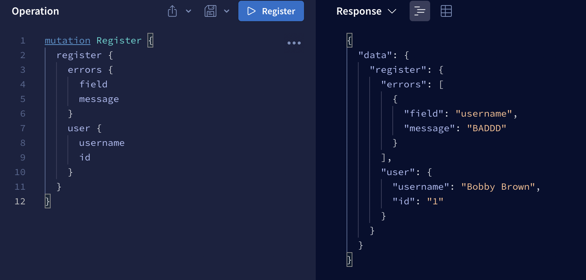

# GraphQL Overview


## Why we used apollo server? // What GraphQL server should I use?

- multiple different options

1. Apollo Server 2.0\* - Most popular and has the most features. But has the largest bundle size (528 kb)
2. Express graph GraphQL - 180 kb bundle size
3. Graph QL yoga - 530 kb.

### reccomended packages

To install dev depedencies, use the following command

```
npm install -D nodemon
```

- add "GraphQL for VSCode" in VS studio to help with coding


# to run the code

- run npm install
- go to the root of the folder and type

```
node index.js
```

## Basic Types

- The values in the function will be cast to the defined type if possible. E.g. 7 here gets cast to a string.

[](/7.png)

- However the reverse won't happen, we couldn't cast a string to an integer.
- We will get exactly what we expect to get back from the server. Otherwise we will get an error in response.
- We can put a "!" on the return type. This will either allow us or prevent us from returning a null value.

[](./NULL.png)

- Query is for getting values. Read operations in CRUD
- Mutation is for changing, updateing or deleting values in CRUD.
- We have standard types, Integers, Booleans, Strings, IDs e.t.c but we can also create custom types for what we want the server to respond with.

- We can then request what we want from the server!


- By wrapping in square brackets we can return an array of a certain type.



## Why is this cool?

- A FE can come over to the playground, see the schema documentaion and understand exactly what they should call for the desired response. In the above example, we can decide to only fetch the ID, or the name, we don't have to fetch both!

### Query 2 example



- Recall that we could return errors as null, as we have no exclamation mark in the typ definition!
- We can also just trutn a bull within a list, e.g. we could add a null to the errors response!
- If we wanted to make sure there are no null errors and the errors array is not null, we could do this:

```

  type RegisterResponse {
    errors: [Error!]!
    user: User
  }
```

### Arrays

- We can have arrays of any Types

### Arguments

We can create arguments with the following

```
type Mutation{
    register(username: String!, password: String!, age: Int): RegisterResponse!
}
```

- You can't make objects in graph QL. But you can make inputs. These work like objects.

## Roundup

- You expose what you want to expose and it will come back with the types you want back,

See reference guide on types below:

https://github.com/sogko/graphql-schema-language-cheat-sheet

# Resolvers

How do they work? What are they? What data can they access?

- They are a function, and they need to return the type we defined in the typeDefs!
- There are 4 paramters passed into resolvers.

1. parent
2. args - with queries and mutations we pass in arguments the same way
3. Context
4. Info

```
Mutation: {
    login: (parent, {userInfo: {username}}, context, info) => {
        return username
    }
}
```
## Context

Context: have access to across all resolver. We define the function on the server initialization and we have access to it across all of our resolver functions.
This allows us to have access to our request and response bodies.

```
const server = new ApolloServer({
  typeDefs,
  resolvers,
  context: ({ req, res }) => ({ req, res }),
});
```

- we can then see data related to the requests in the headers.
- The context can then be console logged so we can see either the req or res.

```
console.log(context.req.header, context.req.body, context.res.headers, context.res.body)
```

- resolvers can be asynchronous. Async or not it will return the promise 
- You can do any kind of operation here. Fetching from a DB or an API. Can use a graph database and mongoDB. Will work with any layer that you want. 

## Info

- Don't really need to use, typically used with libraries. It is a parsed version of the querie that gets run.


## parent

- The parent is what is called before the place where the call is made. So you have access to the data above the call.
- This makes computed fields easy to calculate e.g. such as the first letter.
- We are actually not returning the value from the register resolver. it does not return the first letter of the username. Instead this is being resolved in the user based on what the username is.
- This will work anywhere based on where the user is resolved from.
- We can do this for register and for our user.


# Subscriptions 

- Comes bundled with Apollo servers.

1. Create a new type in our type definitions.
